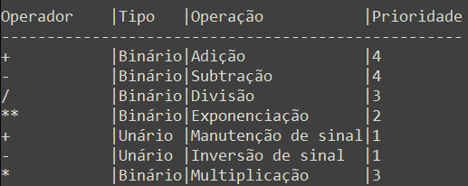
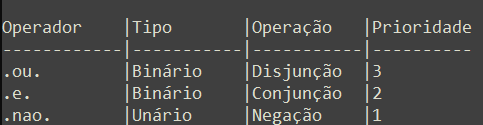

# Conceitos

## Algoritmos

Algoritmo é um conjunto de regras aplicadas a uma seqüência de instruções que é executada. Basicamente é um conjunto de instruções especificadas e ordenadas a serem executadas que podem sofrem comparações condicionais para tomada de decisão, repetições de execuções e tem como objetivo a solução de um determinado problema. </br>

 
## Introdução a programação estruturada</br>
A principal característica da programação estruturada é a possibilidade de dividir o programa em rotinas ou blocos que são independentes, mas podem interagir entre si. Dessa forma o programador consegue modularizar  um programa em varias partes e cada parte resolvendo parte do problema. Devemos considerar também para a programação estruturada, as estruturas: Seqüência, decisão e Interação.</br>

**Seqüência:** Consiste na ordem que um programa executa as instruções de um bloco.</br>
**Decisão:** Consiste na escolha de uma ou varias opções para as ações que o bloco deve executar.</br>
**Iteração:** É a repetição de um bloco de instruções  atendendo uma condição. Caso a condição não seja satisfeita o bloco entrará em um loop infinito.</br>

# Definições

## Tipo de dados
O algoritmo é formado basicamente de dados a serem manipulados e instruções a serem executadas. Esses dados ficam armazenados na memória e precisão ser caracterizadas pelos seus respectivos tipos.

Segue a relação dos dados Básicos:
Tipos		| Descrição
--------|---------------
Inteiros|São os números que não possuem números fracionários, podendo ser positivos ou negativos.
Reais		|São os números que possuem números fracionários, podendo ser positivos ou negativos.
Literais|São formados por uma seqüência de caracteres alfanuméricos.
Lógicos	|São formados por apenas dois valores: Verdadeiro/Falso.


## Variáveis
As variáveis são identificadores utilizados para o armazenamento de valores na memória. São divididas em grupos conforme seus tipos. Para a definição de variáveis em algoritmos iremos adotar a seguinte convenção.

 
Var <NomeVariavel>: TipoVariavel

 
* Utilizaremos a palavra var uma única vez para a definição da região das variáveis.
* As variáveis do mesmo tipo serão definidas na mesma linha e separadas por virgula.
* As variáveis de tipos diferentes serão declaradas em linhas diferentes.
* Variáveis deverão ser iniciadas por caracteres e não deverão conter caracteres especiais, exceto (_).

##### Exemplos:

```
VAR
nome, sobrenome: literal[30]
idade: inteiro
Dependentes: lógico
```

## Operadores
Operadores são representações que possuem a função de atuar sobre os operandos para produzir um resultado. A relação de 1 ou mais operandos/operadores chamados de expressão.

##### Exemplos: 
```
2 + 1 = 3. 
```
Onde 2 e 1 são os operandos, (+) é o operador, e 3 é o resultado.

Quanto a seu tipo podemos definirmos como:
- Unário : Temos um operador incidindo em 1 operando. Ex: -1.
- Binário: Temos um operador incidindo em 2 operandos. Ex: 1-1.


Quanto a sua classificação podemos definirmos como:
- Aritméticos;
- Lógicos;
- Literais.

### Aritméticos:
São operadores relacionados a expressões aritméticas que resultarão um tipo numérico.
.

### Lógicos:
São operadores relacionados a expressões lógicas que resultarão um tipo lógico.
.

 
## Variáveis Indexadas
É um conjunto de variáveis do mesmo tipo referenciadas pelo mesmo nome e acessadas individualmente pela sua posição dentro do conjunto. A referencia de identificação e referencia dos valores das variáveis é feita através de índices. Apesar de não existir restrição a utilização de três ou mais índices, é bem usual a utilização de Vetores (1 índice) ou Matrizes (2 índices).

Forma de Acesso:
Diferente das variáveis, as variáveis indexadas são acessadas através de um índice.

 

Definição:
VAR
<NomeVariavel>: Conjunto[Numero de posições]


##### Exemplo 1 - Manipulando um valor:
```
Algoritmo Programa1
 
VAR
    Salarios: Conjunto[10] real
    Nomes:  Conjunto[10] literal
Inicio
    - Atribuindo um Valor:
    Nomes[3] ß "José da Silva"

    - Lendo  um Valor:
    Leia Nomes[3] 

    - Escrevendo um Valor:
    Escreva Nomes[3]
Fim
```


##### Exemplo 2 - Manipulando um valor:

```
Algoritmo Programa2

VAR
Salarios: Conjunto[10] real
i: Inteiro

Inicio
    Para i de 1 até 10 faça
        Escreva "Entre com o salário para a posição", I
        Leia Salario[i]
    Fim Para

    Para i de 1 até 10 faça
        Escreva "O salario da posicao ", I, "é: "  Salario[i]
    Fim Para
Fim
```

 
## SubAlgoritmos
Subalgoritmos são partes de um algoritmo que tem a finalidade de resolver parte de um problema de forma isolada. Devido a complexidade e tamanho de um algoritmo essa prática se faz necessário. A visibilidade dos subalgoritmos e variáveis é feita de fora para dentro sempre.

Sintaxe:

Algoritmo <Nome do algoritmo> </br>
    VAR <Variáveis Globais> </br>
    <Definição dos subalgoritmos> </br>
    .... </br>
    <Definição dos subalgoritmos> </br>

Inicio </br>
  <Definição do Algoritmo> </br>
Fim </br>

### Definição do Subalgoritmos:

#### Nome 
É o identificador pelo qual será invocado.

#### Corpo 
Contem as instruções a serem executadas.

#### Variáveis
São as variáveis declaradas no próprio Subalgoritmos e só poderão ser utilizadas no mesmo.

#### Parâmetros 
São mecanismos de transferência de dados entre o algoritmo e o Subalgoritmos. Podem ser tipificados como: Valor ou Referencia.

#### Referencia:
* Referência: O valor passado sofre alteração.
* Valor: O valor passado não sofre alteração.

### Tipos de Subalgoritmos:

#### Função
Implicitamente retornam um valor atribuído no Subalgoritmos.

#### Procedimento
Implicitamente não retornam um valor atribuído no Subalgoritmos.


</br>
</br>

# Lista de Exercícios
## Subalgoritmos
[Exercícios de Vetores](ExerciciosVetores.md) <br>
[Exercícios de Sub-algoritmos](ExerciciosSubalgoritmos.md) <br>
